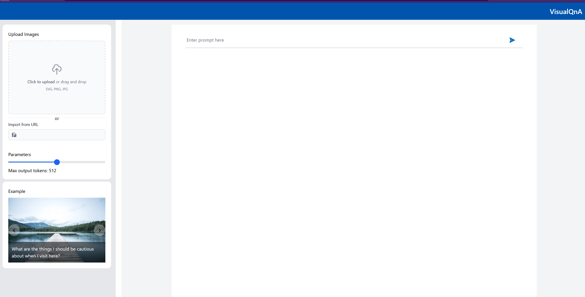
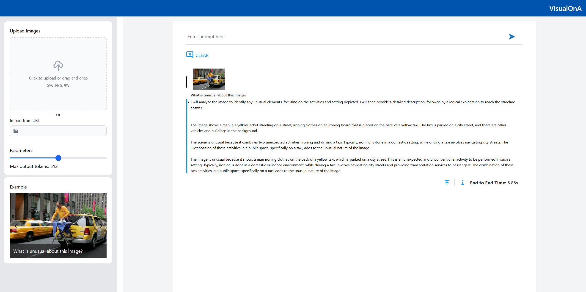

# Build and Deploy VisualQnA Application on AMD GPU (ROCm)

## Build Docker Images

### 1. Build Docker Image

- #### Create application install directory and go to it:

  ```bash
  mkdir ~/visualqna-install && cd visualqna-install
  ```

- #### Clone the repository GenAIExamples (the default repository branch "main" is used here):

  ```bash
  git clone https://github.com/opea-project/GenAIExamples.git
  ```

  If you need to use a specific branch/tag of the GenAIExamples repository, then (v1.3 replace with its own value):

  ```bash
  git clone https://github.com/opea-project/GenAIExamples.git && cd GenAIExamples && git checkout v1.3
  ```

  We remind you that when using a specific version of the code, you need to use the README from this version:

- #### Go to build directory:

  ```bash
  cd ~/visualqna-install/GenAIExamples/VisualQnA/docker_image_build
  ```

- Cleaning up the GenAIComps repository if it was previously cloned in this directory.
  This is necessary if the build was performed earlier and the GenAIComps folder exists and is not empty:

  ```bash
  echo Y | rm -R GenAIComps
  ```

- #### Clone the repository GenAIComps (the default repository branch "main" is used here):

  ```bash
  git clone https://github.com/opea-project/GenAIComps.git
  ```

  If you use a specific tag of the GenAIExamples repository,
  then you should also use the corresponding tag for GenAIComps. (v1.3 replace with its own value):

  ```bash
  git clone https://github.com/opea-project/GenAIComps.git && cd GenAIComps && git checkout v1.3
  ```

  We remind you that when using a specific version of the code, you need to use the README from this version.

- #### Setting the list of images for the build (from the build file.yaml)

  If you want to deploy a vLLM-based or TGI-based application, then the set of services is installed as follows:

  #### vLLM-based application

  ```bash
  service_list="visualqna visualqna-ui nginx lvm vllm-rocm"
  ```

  #### TGI-based application

  ```bash
  service_list="visualqna visualqna-ui nginx lvm"
  ```

- #### Optional. Pull TGI Docker Image (Do this if you want to use TGI)

  ```bash
  docker pull ghcr.io/huggingface/text-generation-inference:2.3.1-rocm
  ```

- #### Build Docker Images

  ```bash
  docker compose -f build.yaml build ${service_list} --no-cache
  ```

  After the build, we check the list of images with the command:

  ```bash
  docker image ls
  ```

  The list of images should include:

  ##### vLLM-based application:

  - opea/vllm-rocm:latest
    - opea/lvm:latest
    - opea/visualqna:latest
    - opea/visualqn-ui:latest
    - opea/nginx:latest

  ##### TGI-based application:

  - ghcr.io/huggingface/text-generation-inference:2.4.1-rocm
    - opea/lvm:latest
    - opea/visualqna:latest
    - opea/visualqn-ui:latest
    - opea/nginx:latest

---

## Deploy VisualQnA Application

### Docker Compose Configuration for AMD GPUs

To enable GPU support for AMD GPUs, the following configuration is added to the Docker Compose file:

- compose_vllm.yaml - for vLLM-based application
- compose.yaml - for TGI-based

```yaml
shm_size: 1g
devices:
  - /dev/kfd:/dev/kfd
  - /dev/dri/:/dev/dri/
cap_add:
  - SYS_PTRACE
group_add:
  - video
security_opt:
  - seccomp:unconfined
```

This configuration forwards all available GPUs to the container. To use a specific GPU, specify its `cardN` and `renderN` device IDs. For example:

```yaml
shm_size: 1g
devices:
  - /dev/kfd:/dev/kfd
  - /dev/dri/card0:/dev/dri/card0
  - /dev/dri/renderD128:/dev/dri/renderD128
cap_add:
  - SYS_PTRACE
group_add:
  - video
security_opt:
  - seccomp:unconfined
```

**How to Identify GPU Device IDs:**
Use AMD GPU driver utilities to determine the correct `cardN` and `renderN` IDs for your GPU.

### Set deploy environment variables

#### Setting variables in the operating system environment:

##### Set variable HUGGINGFACEHUB_API_TOKEN:

```bash
### Replace the string 'your_huggingfacehub_token' with your HuggingFacehub repository access token.
export HUGGINGFACEHUB_API_TOKEN='your_huggingfacehub_token'
```

#### Set variables value in set_env\*\*\*\*.sh file:

Go to Docker Compose directory:

```bash
cd ~/visualqna-install/GenAIExamples/VisualQnA/docker_compose/amd/gpu/rocm
```

The example uses the Nano text editor. You can use any convenient text editor:

#### If you use vLLM

```bash
nano set_env_vllm.sh
```

#### If you use TGI

```bash
nano set_env.sh
```

If you are in a proxy environment, also set the proxy-related environment variables:

```bash
export http_proxy="Your_HTTP_Proxy"
export https_proxy="Your_HTTPs_Proxy"
```

Set the values of the variables:

- **HOST_IP, HOST_IP_EXTERNAL** - These variables are used to configure the name/address of the service in the operating system environment for the application services to interact with each other and with the outside world.

  If your server uses only an internal address and is not accessible from the Internet, then the values for these two variables will be the same and the value will be equal to the server's internal name/address.

  If your server uses only an external, Internet-accessible address, then the values for these two variables will be the same and the value will be equal to the server's external name/address.

  If your server is located on an internal network, has an internal address, but is accessible from the Internet via a proxy/firewall/load balancer, then the HOST_IP variable will have a value equal to the internal name/address of the server, and the EXTERNAL_HOST_IP variable will have a value equal to the external name/address of the proxy/firewall/load balancer behind which the server is located.

  We set these values in the file set_env\*\*\*\*.sh

- **Variables with names like "**\*\*\*\*\*\*\_PORT"\*\* - These variables set the IP port numbers for establishing network connections to the application services.
  The values shown in the file set_env.sh or set_env_vllm they are the values used for the development and testing of the application, as well as configured for the environment in which the development is performed. These values must be configured in accordance with the rules of network access to your environment's server, and must not overlap with the IP ports of other applications that are already in use.

#### Required Models

By default, LVM models are set to a default value as listed below:

| Service   | Model                                       |
| --------- | ------------------------------------------- |
| LVM       | llava-hf/llava-1.5-7b-hf                    |
| LVM       | Xkev/Llama-3.2V-11B-cot                     |

Note:

For AMD ROCm System "Xkev/Llama-3.2V-11B-cot" is recommended to run on ghcr.io/huggingface/text-generation-inference:2.4.1-rocm

#### Set variables with script set_env\*\*\*\*.sh

#### If you use vLLM

```bash
. set_env_vllm.sh
```

#### If you use TGI

```bash
. set_env.sh
```

### Start the services:

#### If you use vLLM

```bash
docker compose -f compose_vllm.yaml up -d
```

#### If you use TGI

```bash
docker compose -f compose.yaml up -d
```

All containers should be running and should not restart:

##### If you use vLLM:

- visualqna-vllm-service
- lvm-server
- visualqna-rocm-backend-server
- visualqna-rocm-ui-server
- visualqna-rocm-nginx-server


##### If you use TGI:

- visualqna-tgi-service
- lvm-server
- visualqna-rocm-backend-server
- visualqna-rocm-ui-server
- visualqna-rocm-nginx-server

---

## Validate the Services

### 1. Validate the vLLM/TGI Service

#### If you use vLLM:

```bash
DATA='{"model": "Xkev/Llama-3.2V-11B-cot", '\
'"messages": [{"role": "user", "content": "What is Deep Learning?"}], "max_tokens": 256}'

curl http://${HOST_IP}:${VISUALQNA_VLLM_SERVICE_PORT}/v1/chat/completions \
  -X POST \
  -d "$DATA" \
  -H 'Content-Type: application/json'
```

Checking the response from the service. The response should be similar to JSON:

```json
{
  "id": "chatcmpl-a3761920c4034131b3cab073b8e8b841",
  "object": "chat.completion",
  "created": 1742959065,
  "model": "Intel/neural-chat-7b-v3-3",
  "choices": [
    {
      "index": 0,
      "message": {
        "role": "assistant",
        "content": " Deep Learning refers to a modern approach of Artificial Intelligence that aims to replicate the way human brains process information by teaching computers to learn from data without extensive programming",
        "tool_calls": []
      },
      "logprobs": null,
      "finish_reason": "length",
      "stop_reason": null
    }
  ],
  "usage": { "prompt_tokens": 15, "total_tokens": 47, "completion_tokens": 32, "prompt_tokens_details": null },
  "prompt_logprobs": null
}
```

If the service response has a meaningful response in the value of the "choices.message.content" key,
then we consider the vLLM service to be successfully launched

#### If you use TGI:

```bash
DATA='{"inputs":"What is Deep Learning?",'\
'"parameters":{"max_new_tokens":256,"do_sample": true}}'

curl http://${HOST_IP}:${VISUALQNA_TGI_SERVICE_PORT}/generate \
  -X POST \
  -d "$DATA" \
  -H 'Content-Type: application/json'
```

Checking the response from the service. The response should be similar to JSON:

```json
{
  "generated_text": "\n\nDeep Learning is a subset of machine learning, which focuses on developing methods inspired by the functioning of the human brain; more specifically, the way it processes and acquires various types of knowledge and information. To enable deep learning, the networks are composed of multiple processing layers that form a hierarchy, with each layer learning more complex and abstraction levels of data representation.\n\nThe principle of Deep Learning is to emulate the structure of neurons in the human brain to construct artificial neural networks capable to accomplish complicated pattern recognition tasks more effectively and accurately. Therefore, these neural networks contain a series of hierarchical components, where units in earlier layers receive simple inputs and are activated by these inputs. The activation of the units in later layers are the results of multiple nonlinear transformations generated from reconstructing and integrating the information in previous layers. In other words, by combining various pieces of information at each layer, a Deep Learning network can extract the input features that best represent the structure of data, providing their outputs at the last layer or final level of abstraction.\n\nThe main idea of using these 'deep' networks in contrast to regular algorithms is that they are capable of representing hierarchical relationships that exist within the data and learn these representations by"
}
```

If the service response has a meaningful response in the value of the "generated_text" key,
then we consider the TGI service to be successfully launched

### 2. Validate the LVM Service

```bash
curl http://${host_ip}:${VISUALQNA_LVM_PORT}/v1/lvm \
    -X POST \
    -H 'Content-Type: application/json' \
    -d '{"image": "iVBORw0KGgoAAAANSUhEUgAAAAoAAAAKCAYAAACNMs+9AAAAFUlEQVR42mP8/5+hnoEIwDiqkL4KAcT9GO0U4BxoAAAAAElFTkSuQmCC", "prompt":"What is this?"}'
```

Checking the response from the service. The response should be similar to JSON:

```textmate
{"downstream_black_list":[],"id":"53fae0310461ce3e7cde5b0930bd3b92","text":"<SUMMARY> I will analyze the image to determine its color and then provide a structured response using the specified format. </SUMMARY>\n\n<CAPTION> The image is a solid block of color. It appears to be a bright, vibrant hue. </CAPTION>\n\n<REASONING> To determine the color, I will observe the image's hue and saturation. The image is a uniform yellow color, which is a bright and noticeable shade. </REASONING>\n\n<CONCLUSION> The image is a bright yellow color. </CONCLUSION>"}
```

If the service response has a meaningful response in the value of the "choices.text" key,
then we consider the vLLM service to be successfully launched

### 3. Validate the MegaService

```bash
DATA='{ 
    "messages": [ 
      { 
        "role": "user", 
        "content": [ 
          { 
            "type": "text", 
            "text": "What'\''s in this image?" 
          }, 
          { 
            "type": "image_url", 
            "image_url": { 
              "url": "https://www.ilankelman.org/stopsigns/australia.jpg" 
            } 
          } 
        ] 
      } 
    ], 
    "max_tokens": 300 
    }'

curl http://${HOST_IP}:${VISUALQNA_BACKEND_SERVICE_PORT}/v1/visualqna \
  -H "Content-Type: application/json" \
  -d "$DATA"
```

Checking the response from the service. The response should be similar to text:

```textmate
{"id":"chatcmpl-ML6oimVzQFmk5dgsAFDSKo","object":"chat.completion","created":1743668853,"model":"visualqna","choices":[{"index":0,"message":{"role":"assistant","content":"<SUMMARY> I will analyze the image to identify key elements and provide a structured response. The focus will be on identifying the main subject of the image. </SUMMARY>\n\n<CAPTION> The image shows a street scene with a prominent red and white \"STOP\" sign in the foreground. In the background, there is a Chinese-style archway with red pillars and decorative elements. The archway is labeled with Chinese characters. </CAPTION>\n\n<REASONING> To determine the main subject of the image, I will focus on the most visually striking and central elements. The \"STOP\" sign is clearly visible and stands out due to its color and position. The archway, while significant, is in the background and does not dominate the image as much as the \"STOP\" sign does. </REASONING>\n\n<CONCLUSION> Stop sign. </CONCLUSION>"},"finish_reason":"stop","metadata":null}],"usage":{"prompt_tokens":0,"total_tokens":0,"completion_tokens":0}}
```

If the output lines in the "choices.text" keys contain words (tokens) containing meaning, then the service is considered launched successfully.

### 4. Validate the Frontend (UI)

To access the UI, use the URL - http://${EXTERNAL_HOST_IP}:${FRONTEND_SERVICE_PORT}
A page should open when you click through to this address:



If a page of this type has opened, then we believe that the service is running and responding,
and we can proceed to functional UI testing.

To check that service is working push on example picture and whait for the answer: 



If the result shown on the page is correct, then we consider the verification of the UI service to be successful.

### 5. Stop application

#### If you use vLLM

```bash
cd ~/visualqnaa-install/GenAIExamples/VisualQnA/docker_compose/amd/gpu/rocm
docker compose -f compose_vllm.yaml down
```

#### If you use TGI

```bash
cd ~/visualqna-install/GenAIExamples/VisualQnA/docker_compose/amd/gpu/rocm
docker compose -f compose.yaml down
```
